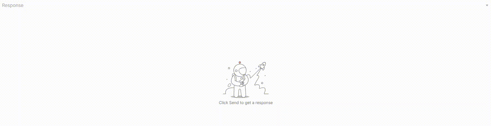
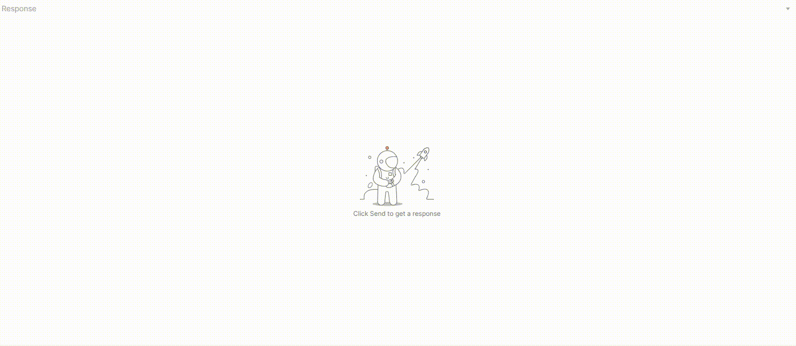
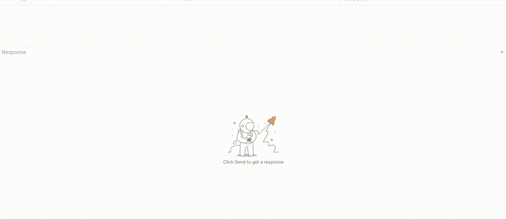

# samples-postman

Provides sample applications for using the FORCAM FORCE Bridge API with Postman.
If you have any questions look at https://forcebridge.io/en/qa-portal/

### Useful Links

* Website: https://www.forcebridge.io/ | https://www.forcam.com/
* Documentation: https://forcebridge.io/en/developers/
* API Definition: https://app.swaggerhub.com/apis-docs/FORCAM/FORCEBridgeAPI/
### Usage / Requirements

###### Access to a FORCAM FORCE Bridge API System

_If you need access to a demo system please contact forcebridge@forcam.com._

Please add your URL, user and password of your Bridge API instance to the variables below (contained by all samples).

```Postman

String client_id; // YOUR USER (e.g. GitHub)
String clinet_secret; // YOUR PASSWORD (e.g. GitHub)
String urlToken = ""; // YOUR URL (e.g. https://forcebridgehackathon.force.eco:24443/ffwebservices/)
```

###### Framework & Tool

* Postman (https://www.postman.com/)

### Description of the sample applications:

# Authentication

A small Postman sample wich authenticates to a FORCAM FORCE Bridge API and prints out the token information.

After creation, the token can be used for all requests. For this, the bearer authorization must be activated in the collection.



Request: "Authentication".

# Get all available workplaces

A small Postman sample wich authenticates to a FORCAM FORCE Bridge API, determine all available workplaces and prints them out.



Request: "GetWorkplaces".

# Get current operating state of a workplace

A small Postman sample wich authenticates to a FORCAM FORCE Bridge API, determine the operating state of an workplace and print it.



Request: "GetWorkplaceByNumber".

# Get all operating states

A small Postman sample wich authenticates to a FORCAM FORCE Bridge API, determine all operating states and prints them out.


Folder: "GetOperatingStates".